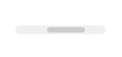

# README #

Компонент **loader.svg** предназначен для вывода изображения прелодера из предустановленного набора.

### Подключение ###

Создайте на сайте директорию `\local\components\iplogic`. Скопируйте в нее скачанную директорию компонента loader.svg.

В нужном месте шаблона сайта добавьте вызов компонента. Код для подключения:

```
<?$APPLICATION->IncludeComponent(
	'iplogic:loader.svg',
	'',
	array(
		"TYPE" => 3,
		"COLOR" => "#ccc",
		"WIDTH" => "100",
		"CACHE_TIME" => 3600000,
		"CACHE_TYPE" => "Y",
	)
);?>
```


### Параметры ###

Параметры компонента описаны в таблице. Стандартные параметры для компонента опущены, о них можно узнать в документации Битрикс.

| Параметр | Описание                    |
| ------------- | ------------------------------ |
| TYPE | Тип прелодера (oт 1 до 12) |
| COLOR | Цвет элементов изображения. Указывается в HEX кодировке, 3 или 6 символов. |
| WIDTH | Ширина изображения. |

### Типы прелодеров ###

1


Кружок вращающийся по кругу и оставляющий след

2


Кружки меняющие прозрачность заливки

3


Радиальная полоска вращающаяся по кругу и оставляющая след

4


Сегмент вращающийся по полупрозрачному кругу

5


Сегмент удвоенной толщины вращающийся по полупрозрачному кругу

6


Вращающийся сегмент изменяющий свой размер

7


Расходящиеся и затухающие концентрические круги

8


Вращающийся затухающий сегмент

9


Три передвигающихся по вертикали кружка

10


Три меняющие размеры кружка

11


Три кружка по углам треугольника сменящие друг друга

12



Полоска меняющая положение и размер